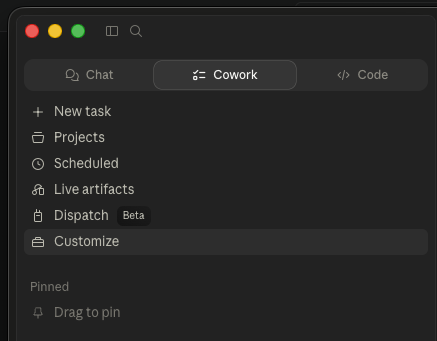
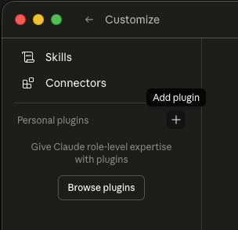
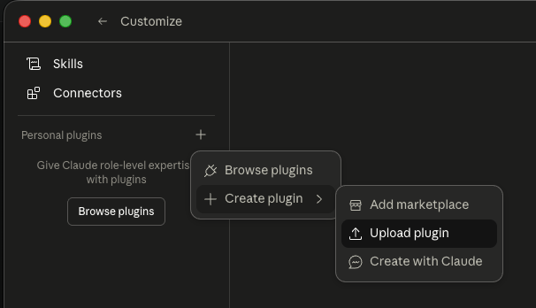
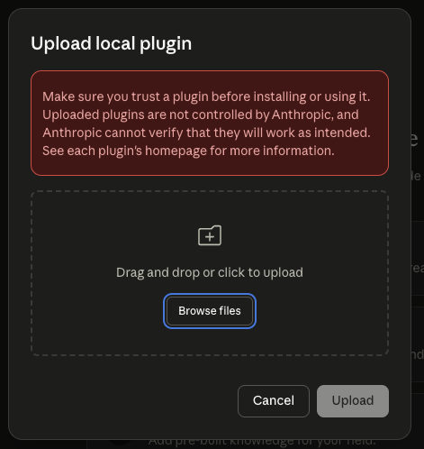
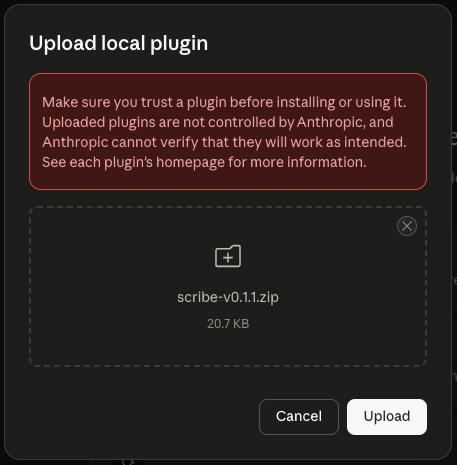
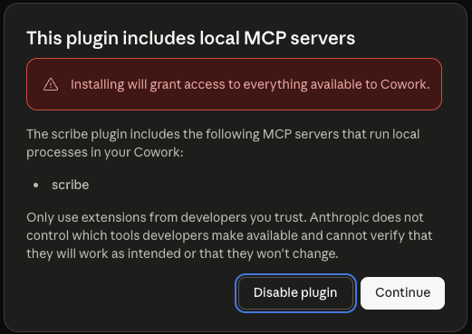
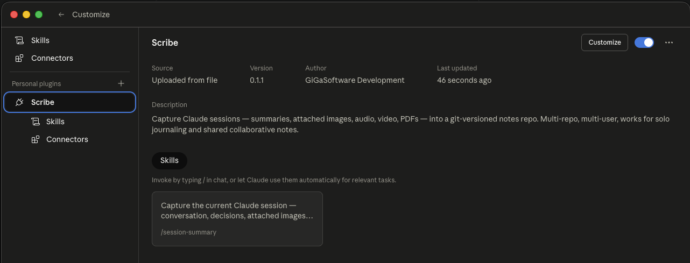

# Setup guide for end users (note-takers, stakeholders, product owners)

A walkthrough for first-time users — no developer experience assumed. You'll spend a few minutes in your computer's command-line app (Terminal on Mac, PowerShell on Windows), then everything else happens inside Claude Cowork.

## How to use this guide

There are two ways:

**Interactive (recommended)** — paste this guide's URL into a Claude Cowork chat and ask Claude to walk you through it:

> https://github.com/GiGaSoftwareDevelopment/claude-marketplace/blob/main/SETUP-END-USER.md
>
> Walk me through this setup guide step by step. Wait after each step until I tell you it's done.

Claude will read the doc, do one step at a time, give you the exact commands to copy-paste, ask you to confirm each step before continuing, and help with any errors that come up. The whole thing takes about 20 minutes the first time.

**Self-paced** — read this file from top to bottom and follow the steps yourself. Same content, just no Claude in the loop. Pick this if you're already comfortable with Terminal commands.

---

<!-- For Claude reading this on behalf of a user:

You're guiding a non-developer through this setup. Conventions:

1. RUN THE PRE-FLIGHT CHECK FIRST. Before sending Step 1, run the pre-flight (see "Pre-flight check" section below). Then skip every prereq step that's already done — don't waste their time on things their machine already has set up.
2. ONE STEP AT A TIME. Don't dump the whole doc. Send a short intro, the command, and what they should see — then wait.
3. Whenever you ask the user to do something, name the literal app ("Open the Terminal app") and give first-time users explicit instructions ("Press Cmd+Space, type Terminal, press Return").
4. Substitute placeholders before showing commands. If their repo is at /Users/alex/Dev/notes, paste that exact path — don't leave <reponame> for them to figure out.
5. Ask them to paste output back when verification is needed. Read what they actually pasted — don't assume "yes I did it" means it worked.
6. For Cowork install steps, the screenshots in `docs/cowork-install/` show what each screen looks like; reference them by step number ("you should see something like the screenshot in step 4 of the docs").
7. If their reply doesn't match what you expected (vague, off-topic, confused), pause and ask one specific clarifying question rather than plowing forward.
8. Output that looks like failure but is fine: `ssh -T git@github.com` exits with code 1 even on success (look for "Hi <username>!"); `git config user.name` prints nothing if unset (means missing, not error).

-->

## What you'll be doing, big picture

1. Make sure your computer has the small set of developer tools needed.
2. Tell your computer who you are (so changes you save are signed with your name).
3. Set up a security key so GitHub can recognize your computer.
4. Download a copy of the team's notes repo.
5. Install the scribe plugin inside Claude Cowork.
6. Tell scribe where your local copy of the notes repo lives.
7. Try saving your first session.

It's mostly copy-paste-and-press-Return. About 20 minutes the first time.

---

## Before you start

You need:

- A Mac (macOS) or Windows PC.
- **Claude Cowork** installed. Download from [claude.ai/download](https://claude.ai/download) if you don't have it.
- A **Claude plan**: Pro, Max, Team, Enterprise, or Console. The free Claude.ai plan does not support plugins.
- A **GitHub account**. Sign up at [github.com](https://github.com) if you don't have one.
- An **invite to the notes repo** — the person who's setting you up will add you as a GitHub collaborator. Check your email for a GitHub invite and accept it before continuing.

---

## Pre-flight check (interactive only — Claude does this for you)

Before walking you through Steps 1–4, Claude can quickly check what's already set up on your computer and skip anything that's already done. If you've used Terminal or git on this Mac before, parts of the setup may already be complete.

**If you're using this guide interactively with Claude**, Claude will run this check first. You'll just paste the output back when asked.

**If you're working through this guide self-paced**, you can either skip this section and do every step in order (safe, but redundant if some are already done) or run the check yourself and skip steps that print real values.

### The check command

Open Terminal (Mac) or PowerShell (Windows) and paste this single command:

**Mac (Terminal):**

```bash
echo ""; \
echo "=== paste this entire output back to Claude ==="; \
echo ""; \
echo "git: $(git --version 2>/dev/null || echo MISSING)"; \
echo "python: $(python3 --version 2>/dev/null || echo MISSING)"; \
echo "git_user_name: $(git config --global user.name 2>/dev/null || echo MISSING)"; \
echo "git_user_email: $(git config --global user.email 2>/dev/null || echo MISSING)"; \
echo "ssh_key: $(ls ~/.ssh/id_ed25519.pub 2>/dev/null || echo MISSING)"; \
echo "github_ssh: $(ssh -T -o BatchMode=yes -o ConnectTimeout=5 git@github.com 2>&1 | head -1)"
```

**Windows (PowerShell):**

```powershell
"=== paste this entire output back to Claude ==="
"git: " + (try { git --version } catch { "MISSING" })
"python: " + (try { python --version } catch { "MISSING" })
"git_user_name: " + (try { git config --global user.name } catch { "MISSING" })
"git_user_email: " + (try { git config --global user.email } catch { "MISSING" })
"ssh_key: " + $(if (Test-Path ~/.ssh/id_ed25519.pub) { "FOUND" } else { "MISSING" })
"github_ssh: " + ((ssh -T -o BatchMode=yes -o ConnectTimeout=5 git@github.com 2>&1) | Select-Object -First 1)
```

Press **Return** / **Enter**. You'll see seven lines of output. Paste them back to Claude (or read them yourself).

### How to interpret the output

| Line | What "good" looks like | What "needs setup" looks like |
|---|---|---|
| `git:` | `git version 2.x.x` (any version is fine) | `MISSING` → do **Step 2** |
| `python:` | `Python 3.10.x` or higher | `MISSING` or version below 3.10 → do **Step 2** |
| `git_user_name:` | Your name | `MISSING` → do **Step 3** |
| `git_user_email:` | Your email | `MISSING` → do **Step 3** |
| `ssh_key:` | A path ending in `id_ed25519.pub` | `MISSING` → do **Step 4** |
| `github_ssh:` | Starts with `Hi <username>!` | Anything else (e.g., `Permission denied`) → do **Step 4** |

If every line looks good, **skip to [Step 5 — Download the notes repo](#step-5--download-the-notes-repo)**. The interesting work starts there.

<!-- For Claude:

When the user pastes the pre-flight output back, parse each line and decide which steps to skip.

- `git:` and `python:` lines → if both look fine, skip Step 2 entirely. If one is MISSING, do that part of Step 2 only.
- `git_user_name:` and `git_user_email:` → if both have values, skip Step 3. If either is MISSING, run that single command from Step 3.
- `ssh_key:` → if MISSING, do Step 4 (key generation through GitHub setup). If present but `github_ssh:` doesn't start with "Hi ...!", the key exists locally but isn't registered with GitHub — walk them through just the "Add the key to GitHub" + verify portion of Step 4, skipping the keygen.
- `github_ssh:` showing "Hi <username>!" → SSH is fully working, skip Step 4 entirely.

Tell the user what you're skipping and why ("Looks like git, your identity, and your SSH key are already set up — jumping ahead to Step 5"). Don't silently skip; users want to know what got covered.

If anything in the output is unclear or doesn't fit the patterns above, pause and ask the user a specific question rather than guessing.

-->

---

## Step 1 — Open your shell

This is where you'll paste the commands in Steps 2–4.

**Mac:** Press **Cmd+Space**, type **Terminal**, press **Return**. A window with a blinking cursor appears.

**Windows:** Click the **Start** menu, type **PowerShell**, press **Enter**. (Use plain PowerShell, not "Windows PowerShell ISE.")

When a step shows a command, click into the window, paste with **Cmd+V** (Mac) or **Ctrl+V** (Windows), and press **Return** / **Enter** to run it. Read what's printed afterward — if something fails, the error message is the most useful thing to share with whoever's helping you.

---

## Step 2 — Install developer tools

These give you `git` (for downloading the notes repo) and supporting tools.

### macOS

In Terminal, run:

```
xcode-select --install
```

If a small window pops up, click **Install** and wait — a few minutes. If it instead says *"command line tools are already installed"*, you're set.

Verify:

```
git --version
```

You should see a version number.

### Windows

Download and install **Git for Windows** from [git-scm.com/download/win](https://git-scm.com/download/win). Accept the default options.

After install, **close and reopen** PowerShell, then verify:

```powershell
git --version
```

---

## Step 3 — Tell your computer who you are

Same command on Mac and Windows. Replace the values in quotes with your real name and the email associated with your GitHub account:

```
git config --global user.name "Your Name Here"
```

```
git config --global user.email "youremail@example.com"
```

Verify:

```
git config --global user.name
```

Should print the name you just set.

---

## Step 4 — Set up a GitHub SSH key

GitHub needs to recognize your machine when you download the notes repo or save changes to it.

### Generate the key

In your shell, run:

```
ssh-keygen -t ed25519 -C "youremail@example.com"
```

When prompted:
- *"Enter file in which to save the key"* — press **Return** to accept the default.
- *"Enter passphrase"* — press **Return** twice to skip, or set one if you prefer extra security.

### Copy the public key

**Mac:**

```bash
pbcopy < ~/.ssh/id_ed25519.pub
```

**Windows (PowerShell):**

```powershell
Get-Content ~/.ssh/id_ed25519.pub | Set-Clipboard
```

### Add the key to GitHub

In your browser, go to [github.com/settings/ssh/new](https://github.com/settings/ssh/new):

- **Title:** anything memorable (e.g., *"My MacBook"* or *"Work PC"*)
- **Key:** paste with **Cmd+V** / **Ctrl+V**
- Click **Add SSH key**

### Verify

In your shell:

```
ssh -T git@github.com
```

Type **yes** if it asks about a fingerprint. You should see:

> Hi `<your-github-username>`! You've successfully authenticated, but GitHub does not provide shell access.

That's success. The "no shell access" line is normal.

---

## Step 5 — Download the notes repo

The person who set you up will tell you the repo address — it looks like `git@github.com:<owner>/<reponame>.git`.

**Mac (Terminal):**

```bash
mkdir -p ~/Dev && cd ~/Dev
git clone git@github.com:<owner>/<reponame>.git
```

**Windows (PowerShell):**

```powershell
New-Item -ItemType Directory -Force -Path ~/Dev | Out-Null
cd ~/Dev
git clone git@github.com:<owner>/<reponame>.git
```

You'll now have a folder at `~/Dev/<reponame>`. **Remember this path** — Step 7 needs it.

If you get a permission error, you probably haven't accepted the GitHub collaborator invite (check your email).

---

## Step 6 — Install the scribe plugin in Cowork

### Download the plugin

Click this link to download `scribe-v0.1.3.zip`:

**[Download scribe v0.1.3](https://github.com/GiGaSoftwareDevelopment/claude-marketplace/releases/download/v0.1.3/scribe-v0.1.3.zip)**

Saves to your Downloads folder. To browse all versions, see [all releases](https://github.com/GiGaSoftwareDevelopment/claude-marketplace/releases).

### Open Cowork's plugin manager

In Cowork, find the **Customize** entry — usually accessed from a sidebar or menu in the chat view.



### Add a personal plugin

Click the **+** next to **Personal plugins**.



### Choose "Upload plugin"

Pick **Upload plugin** from the menu.



### Select the zip

Click **Browse files** and pick the `scribe-v0.1.3.zip` you downloaded.



Or drag the zip from Finder / Explorer directly into the dialog's drop zone.



### Confirm MCP server registration

Cowork will ask you to confirm registering the plugin's MCP server. Click **Continue**.



The MCP server is what lets the plugin write notes to your repo and run git on your behalf — it runs as you, on your computer.

### Confirm the install

You should see scribe under **Personal plugins** with version, source, and the **Skills** tab populated with `/session-summary`.



### Restart Cowork

**Quit Cowork completely** (Cmd+Q on Mac, or Cowork → Quit Cowork in the menu bar) and reopen it. This is required so the new plugin loads into a fresh session.

---

## Step 7 — Configure scribe

In a fresh Cowork chat, tell Claude (replace `<your-repo-name>` with whatever you cloned in Step 5):

> Configure scribe to save my notes to ~/Dev/&lt;your-repo-name&gt;

The `~` part expands automatically to your home folder, so this works on any Mac or Windows machine without typing your full path.

Claude will set things up and confirm. It figures out your user-folder name automatically from the git identity you set in Step 3.

Then verify everything works end-to-end:

> Verify my scribe install.

Claude runs a series of checks. Everything should come back green or with a single yellow `notes_user_dir_exists` warning (the folder is created on your first save). If anything's red, the message tells you what to fix.

---

## Step 8 — Save your first session

You're done with setup. Have a short conversation with Claude — talk through whatever's on your mind for the day. Then send:

```
/session-summary
```

Or just say it conversationally:

> Save this to scribe.

Claude writes a markdown file into the notes repo, commits it, and pushes it to GitHub. Verify by going to the repo on github.com — your new file appears in your personal user-folder.

---

## What to do if something goes wrong

- **A command says "command not found".** Re-run Step 2.
- **GitHub says "Permission denied (publickey)".** Re-do Step 4.
- **`/session-summary` doesn't seem to do anything.** You probably forgot to fully restart Cowork after installing the plugin (Step 6). Quit completely, reopen, try again.
- **Cowork shows scribe but no skills under it.** You're on an outdated zip. Download the latest from Step 6 and re-upload.
- **Claude says push failed.** You probably haven't accepted the GitHub collaborator invite, or your access is read-only. Check with the person who set you up.
- **Anything else.** Copy what's on your screen and send it to whoever's helping you.

---

## What this guide covered

| You did | So that |
|---|---|
| Installed developer tools (Xcode CLT or Git for Windows) | Your computer has `git` |
| Set git identity | Notes get attributed to you |
| Created and registered an SSH key | GitHub recognizes your computer |
| Cloned the notes repo | You have a local copy on disk |
| Installed scribe in Cowork | The plugin's commands are available in chat |
| Pointed scribe at your repo | Saves know where to write |

Once this is done, the only thing you need day-to-day is opening Cowork, having a conversation, and saying *"save this to scribe"* (or running `/session-summary`) at the end. Everything else is automatic.

---

## For software engineers

If you're an engineer who'll consume notes, build tooling, or work with the corpus from a CLI, see [SETUP-DEV-TEAM.md](SETUP-DEV-TEAM.md) instead — that walks through the Claude Code install path.
